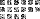
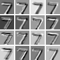

# Interactive CNN Digit Classifier

A Streamlit experience for drawing digits, tweaking the first convolutional layer, and stepping through every stage of a LeNet-style CNN. The app exposes tensors, filters, feature maps, pooling, dense layers, probabilities, and a saliency overlay so learners can see how a prediction forms.



## Features
- **Dual canvas modes (28×28 or 140×140)** with Clear, Undo, and “Random MNIST sample” helpers.
- **Configurable first convolution**: stride, padding, kernel size (3×3 or 5×5), and filter count. Changes immediately reflow through the captured layers.
- **Step-by-step timeline** with slider, single-step, and “play all” controls. Each stage shows inputs, kernels, feature maps/activations, and metadata tooltips.
- **Prediction readout**: top-3 probabilities, a metric card, and a saliency overlay (input gradients) that highlights influential pixels.
- **Explain mode sidebar** describing convolution, padding, stride, pooling, dense layers, and softmax in plain English.
- **Model options**: load the shipped pretrained MNIST weights or flip to a random initialization mode to compare behaviour.

## Project layout
```
.
├── app.py                # Streamlit UI
├── models/lenet_mnist.pt # Pretrained weights (98%+ MNIST accuracy)
├── scripts/train_lenet.py
├── src/
│   ├── model.py          # LeNet definition / loader
│   ├── preprocess.py     # Canvas → normalized tensor utilities
│   ├── inference.py      # Layer capture + saliency helpers
│   └── visualize.py      # Grid helpers, saliency overlays, etc.
├── tests/test_inference.py
├── assets/               # Sample visualizations for documentation
└── requirements.txt
```

## Getting started
1. **Create a virtual environment**
   ```bash
   python3 -m venv .venv
   source .venv/bin/activate
   ```
2. **Install dependencies**
   ```bash
   pip install --upgrade pip
   pip install -r requirements.txt
   ```
3. **Run the app**
   ```bash
   streamlit run app.py
   ```
4. **Optional**: regenerate weights
   ```bash
   python3 scripts/train_lenet.py --epochs 8 --batch-size 256
   ```

## Using the UI
- Choose a **canvas resolution** (28×28 for coarse pixels, 140×140 for smoother drawing). The pipeline always re-centers and normalizes to MNIST stats.
- Use **Undo**, **Clear**, or **Random sample** (loads a held-out MNIST digit) to manage the canvas.
- Click **Classify** to capture the drawing. After that, adjusting stride/padding/kernel/filter controls automatically replays inference.
- Navigate layers via **Single step ▶**, **Play all ⏭**, or the **Scrub layers slider**.
- Hover tooltips on the controls to reinforce what stride, padding, kernel size, and filter count do.

## Visualization reference
| Pane | Description | Sample |
| --- | --- | --- |
| Input tensor | Centered + normalized digit fed to Conv1 |  |
| Conv kernels | Learned 5×5 filters from Conv1 |  |
| Feature maps | Post-convolution activations (per-filter grid) |  |
| Saliency | Gradient-based heat map over the input |  |

## Testing
Run the automated checks (shape coverage + MNIST accuracy ≥ 98%):
```bash
python3 -m pytest -q
```

## Known pitfalls & tips
- **Color polarity**: MNIST digits are white on black. The preprocess step inverts canvas strokes (black on white) and recenters via bounding-box heuristics. If strokes are faint or not centered, accuracy drops.
- **Thin strokes**: Narrow brush sizes can vanish after downsampling—especially in 28×28 mode. Increase the brush to keep enough signal.
- **Random weights mode**: Expect near-uniform probabilities. Use it to contrast with the pretrained checkpoint.
- **Matplotlib cache warnings**: If Streamlit reports `.matplotlib` permission warnings, set `MPLCONFIGDIR` to a writable folder (e.g., `export MPLCONFIGDIR=$PWD/.mplcache`).

## Troubleshooting
- **Slow first run**: Torchvision downloads MNIST the first time. Subsequent runs reuse `./data`.
- **Accuracy regression**: Re-run `scripts/train_lenet.py` to refresh weights, then re-run `pytest` to confirm ≥98% test accuracy.
- **Canvas not updating**: Undo/Random sample reset the background by bumping the internal canvas key. If problems persist, refresh the Streamlit page to clear session state.

Enjoy exploring how every convolution, ReLU, pool, and dense layer contributes to a digit prediction!
